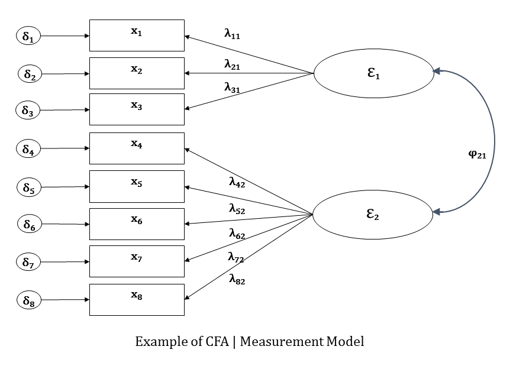

hhj 
Here is the greek letter lambda ($\lambda$). Here is beta $\beta$. Selecting the preceding developments, we are now ready to state the posterior distribution for all the unknowns:
\begin{align*}
	p(\Xi, \kappa, \Phi, \tau, \Lambda, \Psi \mid \mathbf{x}) &\propto p(\mathbf{x} \mid \Xi, \kappa, \Phi, \tau, \Lambda, \Psi) p(\Xi, \kappa, \Phi, \tau, \Lambda, \Psi) \\
	&= p(\mathbf{x} \mid \Xi, \tau, \Lambda, \Psi) p(\Xi \mid \kappa, \Phi) p(\kappa) p(\Phi) p(\tau) p(\Lambda) p(\Psi) \\
	&= \prod_{i = 1}^{n} \prod_{j = 1}^{J} \prod_{m = 1}^{M} p(x_{ij} \mid \xi_i, \tau_j, \lambda_j, \psi_{ij}) p(\xi_i \mid \kappa, \Phi) p(\kappa_m) p(\Phi) p(\tau_j) p(\lambda_{jm}) p(\psi_{jj}), 
	\intertext{where}
	x_{ij} \mid \xi_i, \tau_j, \lambda_j, \psi_{ij} &\sim N(\tau_j + \xi_i \lambda_j^\prime, \psi_{jj}) \mbox{ for } i = 1, \ldots, n, \ j, \ldots, J, \\
	\xi_i \mid \kappa, \Phi &\sim N(\kappa, \Phi) \mbox{ for } i = 1, \ldots, n, \\
	\kappa_m &\sim N(\mu_{\kappa}, \sigma_{\kappa}^2) \mbox{ for } m = 1, \ldots, M, \\
	\Phi &\sim \mbox{Inv-Wishart}(\Phi_0, d), \\
	\tau_j &\sim N(\mu_{\tau}, \sigma_{\tau}^2) \mbox{ for } j = 1, \ldots, J, \\
	\lambda_{jm} &\sim N(\mu_{\lambda}, \sigma_{\lambda}^2) \mbox{ for } j = 1, \ldots, J, \ m = 1, \ldots, M, 
	\intertext{and}
	\psi_{jj} &\sim \mbox{Inv-Gamma}(\frac{\nu_{\psi}}{2}, \frac{\nu_{\psi} \psi_0}{2}) \mbox{ for } j = 1, \ldots, J.
\end{align*}

Data come from my undergraduate honors thesis where I recorded the responses to the Satisfaction with Life Scale. The SWLS is a scale designed to measured global cognitive evaluations of ones view of their life. There were a total of 656 respondents and the SWLS consists of the following 5 items:
	\begin{enumerate}
		\item In most ways my life is close to my ideal. 
		\item The conditions of my life are excellent.
		\item I am satisfied with my life.
		\item So far I have gotten the important things I want in life.
		\item If I could live my life over, I would change almost nothing.
	\end{enumerate}
Estimation was carried out on R using MCMC Metropolis Hastings Algorithm.

 I’m creating a macro and need some text for testing purposes.

* I’m trying to learn more about some feature of Microsoft Word and don’t want to practice on a real document.

Microsoft Word 97, 98, 2000, and 2001 include an undocumented feature that generates all of the sample text I need. Maybe you’ll find it helpful too. To use it, type the following line into a Word document and press the ENTER key:

=Rand(1,1)

Word will insert the following text into your document:

The quick brown fox jumps over the lazy dog.

(As you probably know, this sentence includes every letter in the alphabet and is sometimes used for typing practice.)

Need more than one sentence? You can specify how many sentences you need by changing the last number in the Rand statement. For example, if you needed five sentences, you could type this–

=Rand(1,5)

–which would produce this:

The quick brown fox jumps over the lazy dog. The quick brown fox jumps over the lazy dog. The quick brown fox jumps over the lazy dog. The quick brown fox jumps over the lazy dog. The quick brown fox jumps over the lazy dog.

Need more than one paragraph? You can specify how many paragraphs you need by changing the first number in the Rand statement. For example, if you needed two paragraphs (with five sentences in each one), you could type this–

=Rand(2,5)

–which would produce this:

The quick brown fox jumps over the lazy dog. The quick brown fox jumps over the lazy dog. The quick brown fox jumps over the lazy dog. The quick brown fox jumps over the lazy dog. The quick brown fox jumps over the lazy dog.

The quick brown fox jumps over the lazy dog. The quick brown fox jumps over the lazy dog. The quick brown fox jumps over the lazy dog. The quick brown fox jumps over the lazy dog. The quick brown fox jumps over the lazy dog.

In other words, the first number specifies the number of paragraphs you want to insert; the second number specifies the number of sentences you want to include in those paragraphs.
